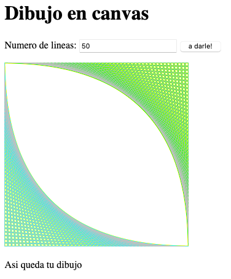

# canvas

## Bienvenido! 👋

Vamos a dibujar en HTML, para esto usamos la etiqueta

Para dibujar usamos JS para darle las instrucciones y los canvas funcionan con coordenadas

Solamente llegando al canvas no podemos dibujar, debemos crear un contexto, ahora sí, mira cómo dibujar con HTML y JavaScript

Recuerda:
- ID es el identificador con el que podemos encontrar etiquetas con JavaScript, los nombres siguen las mismas reglas que las variables 
- Puedes obtener un elemento con su id buscándolo con document.getElementById('nombre_id');

Los eventos son funciones que suceden cuando algo ocurre,  sucesos cómo un click, pulsar una tecla, colocar el mouse sobre un botón, etc.

Creemos un programa que reciba la cantidad de líneas con las que queremos crear nuestra imagen.

Recuerda:

- Cuando queremos enviar información a un servidor podemos usar un formularios
- En JavaScript puedes agregar un manejador de eventos con element.addEventListener('event', function)
